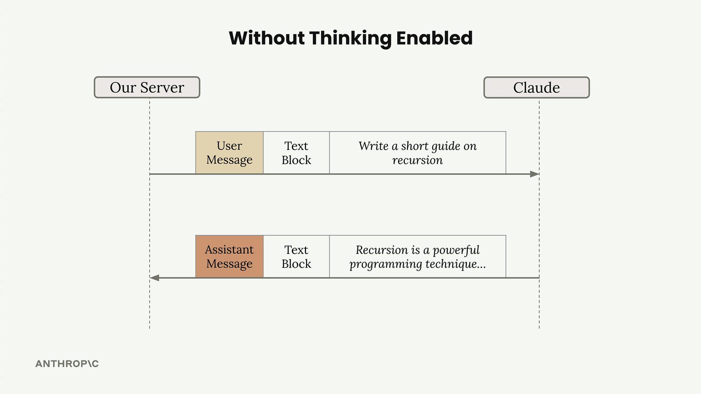
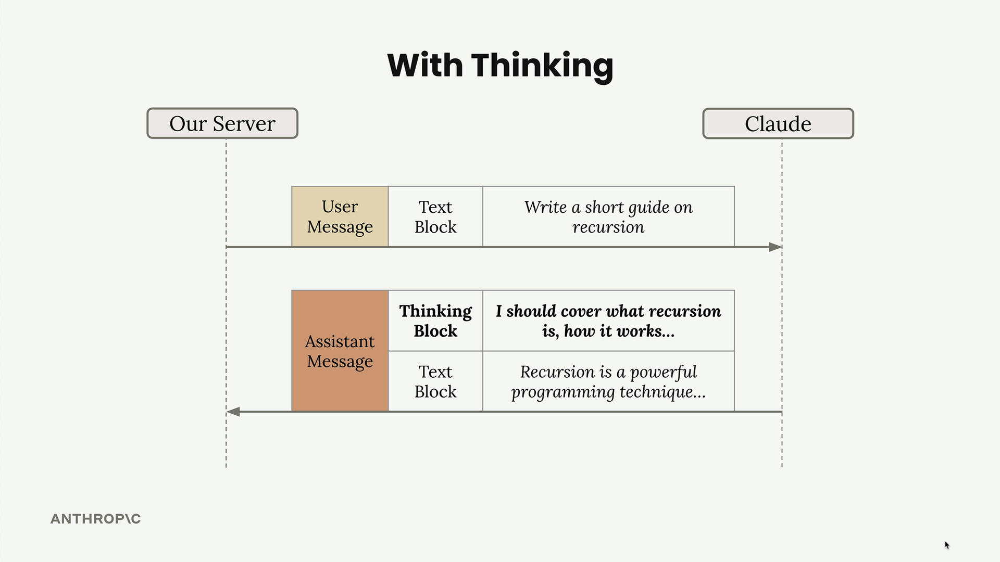

#### Extended thinking 

Extended thinking is Claude's advanced reasoning feature that gives the model time to think through complex problems before generating a response. When enabled, Claude produces a visible thinking process that users can examine to understand how the model approached their query.

This feature significantly improves Claude's ability to handle complex tasks with greater accuracy, but it comes with **important trade-offs**. You'll be charged for all tokens generated during the thinking phase, and the additional processing time increases response latency. The key is knowing when the improved intelligence justifies the extra cost and wait time.

#### When to Use Extended Thinking

The decision to enable extended thinking should be driven by your prompt evaluations. Here's the recommended approach:

- Write and test your prompt without extended thinking first
- Run evaluations to measure accuracy
- If results aren't meeting your standards after prompt optimization efforts
- Then consider enabling extended thinking as a solution

#### How Extended Thinking Changes Responses

Without extended thinking, Claude's response flow is straightforward - you send a user message with a text block and receive an assistant message with a text block in return.



With extended thinking enabled, the response structure changes significantly. You'll receive an assistant message containing two distinct blocks:




## The Signature System

Each thinking block includes a **cryptographic signature** that serves an important security purpose. This signature ensures that the thinking text hasn't been modified when you include the message in future conversation turns.Claude relies heavily on the thinking content for response generation, so preventing tampering is crucial for maintaining safe and consistent behavior. If you modify the thinking text, the signature validation will fail.

#### Image Support 

Claude's vision capabilities let you include images in your messages and ask Claude to analyze them in sophisticated ways. You can ask Claude to describe image contents, compare multiple images, count objects, or perform complex visual analysis tasks.

When working with images in Claude, you need to understand several key limitations:

- Up to 100 images across all messages in a single request
- Max size of 5MB per image
- When sending one image: max height/width of 8000px
- When sending multiple images: max height/width of 2000px
- Images can be included as base64 encoding or a URL to the image
- Each image counts as tokens based on dimensions: `tokens = (width px × height px) / 750`

## Prompting Techniques

The most important thing to understand about Claude's vision capabilities is that good prompting techniques are absolutely critical. Simple prompts often produce poor results, even with clear images.

For example, asking "How many marbles are in this image?" with an image containing 12 marbles might return an incorrect count of 13. You can dramatically improve accuracy by applying the same prompting engineering techniques you'd use for text:

- Providing detailed guidelines and analysis steps
- Using one-shot or multi-shot examples
- Breaking down complex tasks into smaller steps

Instead of a simple question, provide Claude with a methodology:

```text
Analyze this image of marbles and determine the exact count using this methodology:
1. Begin by identifying each unique marble one at a time. Assign each a number as you identify it.
2. Verify your result by counting with a different method. Start from the bottom-left corner and work row by row, from left to right.

What is the exact, verified number of marbles in this image?
```

Real-World Examples

1. Fire Risk Assesments 
2. Design as mobile layouts

#### Citations 

When Claude answers questions based on documents you provide, users might assume it's just pulling information from its training data. But what if Claude is actually citing specific sources? The citations feature lets you show users exactly where Claude found its information, building trust and transparency into your AI applications.

## Why Citations Matter

Without citations, users see Claude's responses as coming from memory. They have no way to verify the information or understand that it's based on specific documents you provided. Citations solve this by showing users the exact source material Claude used to generate each part of its response.

## Citation Structure

### Each citation contains:

**cited_text** - The exact text Claude is referencing from your document
**document_index** - Which document (if you provided multiple)
**document_title** - The title you assigned to the document
**start_page_number** - Where the cited text begins
**end_page_number** - Where the cited text ends

### When to Use Citations

Citations are essential when:

- Users need to verify information accuracy
- You're working with sensitive or important documents
- Transparency about sources builds trust in your application
- Users might want to read the original source material

By implementing citations, you transform Claude from a "black box" that gives answers into a transparent system that shows its work, making your AI applications more trustworthy and verifiable.

## Prompt Caching

Prompt caching is a feature that speeds up Claude's responses and reduces the cost of text generation by reusing computational work from previous requests. Instead of throwing away all the processing work after each request, Claude can save and reuse it when you send similar content again.

## How Claude Normally Processes Requests

To understand prompt caching, let's first look at what happens during a typical request without caching enabled.

When you send a message to Claude, it doesn't immediately start generating a response. Instead, Claude performs extensive preprocessing work on your input:

- Tokenizes the prompt (breaks text into smaller units)
- Creates embeddings for each token (mathematical representations)
- Adds context based on surrounding text
- Only then generates the actual output text

After sending you the response, Claude discards all this computational work. Everything gets thrown away, and Claude declares itself ready for the next request.

## The Problem with Repeated Content

Here's where things get inefficient. Imagine you're having a conversation with Claude, so your follow-up request includes:

- The same original user message from before
- Claude's previous response
- Your new follow-up message

Claude has to reprocess that original message all over again, even though it just analyzed the exact same content moments earlier. As Claude might think: "I just processed that message and threw away all the work I did. I could have reused it!"

## How Prompt Caching Solves This

Prompt caching changes this wasteful process. Instead of discarding the preprocessing work, Claude saves it in a cache.

## Here's how it works:

1. **Initial request**: Claude processes your message and writes the computational work to a cache
2. **Follow-up requests**: When Claude sees the same content again, it reads the previously processed work from the cache instead of starting over

The cache acts like a lookup table: "If I ever see this message again, I'll reuse this work I already did."


## Key Benefits and Limitations

#### Prompt caching offers several advantages:

- **Faster responses**: Requests using cached content execute more quickly
- **Lower costs**: You pay less for processing that reuses cached work
- **Automatic optimization**: The initial request writes to cache, follow-up requests read from it

However, there are important limitations to keep in mind:

- **Short lifespan**: Cache only lives for 5 minutes
- **Exact matches required**: Only useful when you're repeatedly sending the same content
- **Common use case**: This happens extremely frequently in conversational applications and document analysis workflows

Prompt caching is particularly valuable for applications where users frequently reference the same documents, continue conversations, or iterate on similar prompts within a short timeframe. The process follows a simple pattern: your initial request will write to the cache, and follow-up requests can read from the cache. The cache lives for 5 minutes, so this feature is only useful if you're repeatedly sending the same content - but this happens extremely frequently in real applications.

## Cache Breakpoints

Work done on messages is not cached automatically. We have to manually add a 'cache breakpoint' to a block. Work done for everything before the breakpoint will be cached, and the cache will only be used on follow-up requests if the content up to and including the breakpoint is identical.

## How Cache Breakpoints Work

Cache breakpoints span messages and can cache assistant messages too. When you place a breakpoint, everything up to that point gets cached. Remember, content must be identical to use the cache!In a follow-up request, Claude reads the previously processed work from the cache instead of reprocessing it:

## Breakpoint Location

You're not restricted to text blocks! You can add cache breakpoints to system prompts and tool definitions. These are actually the most common caching opportunities since they rarely change between requests.

## Cache Ordering

You can add up to four cache breakpoints total. If you place a breakpoint on your last tool, everything up to that tool gets cached, but the system prompt and messages won't be. This gives you fine-grained control over what gets cached based on what changes in your application.

## Minimum Content Length

Content must be at least `1024` tokens long to be cached (sum of all messages/blocks you're trying to cache). A simple "Hi there!" message won't meet this threshold, but if you duplicate that text 500 times, you'll have enough tokens to cache.The key to effective prompt caching is identifying the parts of your requests that stay consistent - usually your system prompts and tool definitions - and placing breakpoints strategically to maximize cache hits while minimizing reprocessing.


